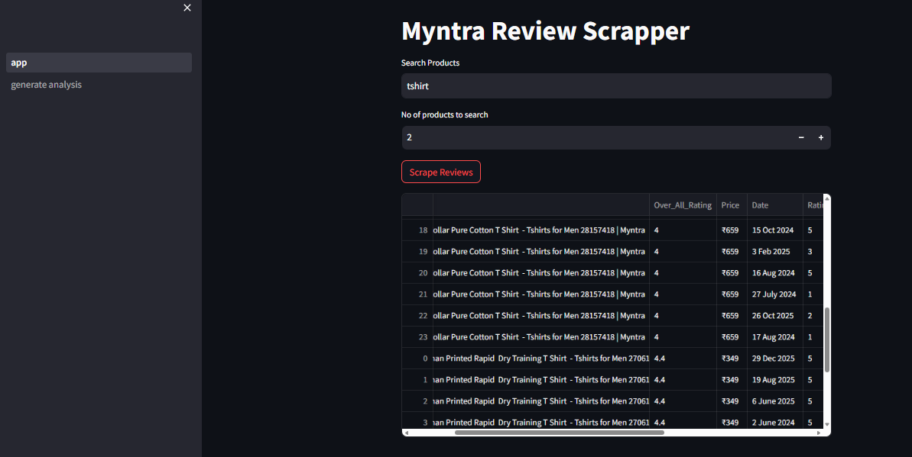
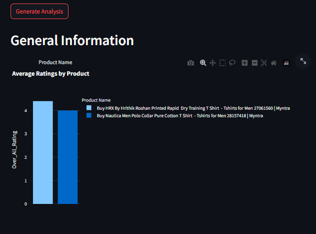
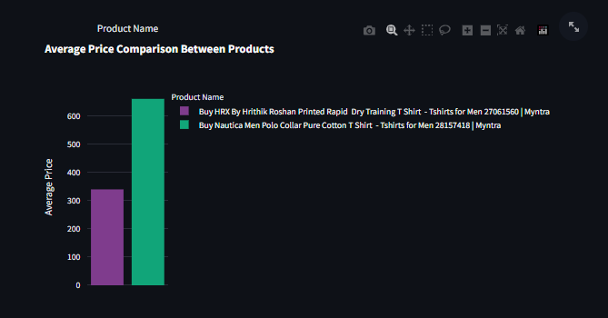
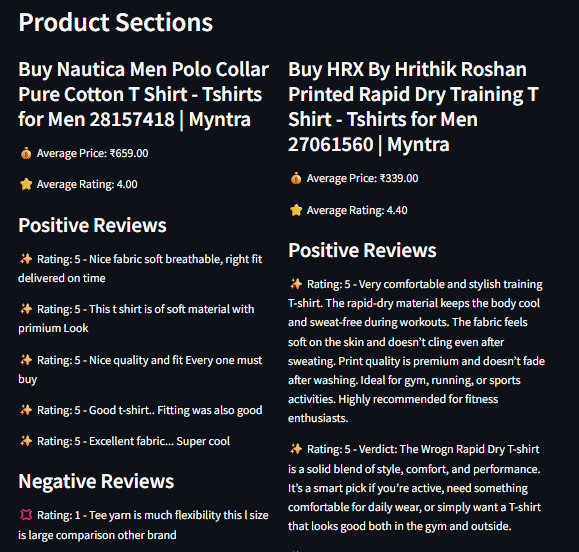

# Myntra Review Scraper Project 

## About the Project
This project scrapes product reviews from Myntra and generates an interactive dashboard using Streamlit.  
It helps analyze product ratings, pricing trends, and customer sentiment.

## Features
- Scrape reviews for multiple products
- Store data in MongoDB
- Interactive dashboard
- Positive and negative review extraction

## Tech Stack
- Python
- Streamlit
- BeautifulSoup
- Pandas
- Plotly
- MongoDB

## How to Run
conda create -n myntra_env python=3.10  
conda activate myntra_env  
pip install -r requirements.txt  
streamlit run app.py  

## Dashboard Preview

### Overview

### Ratings

### Pricing

### Comparison

